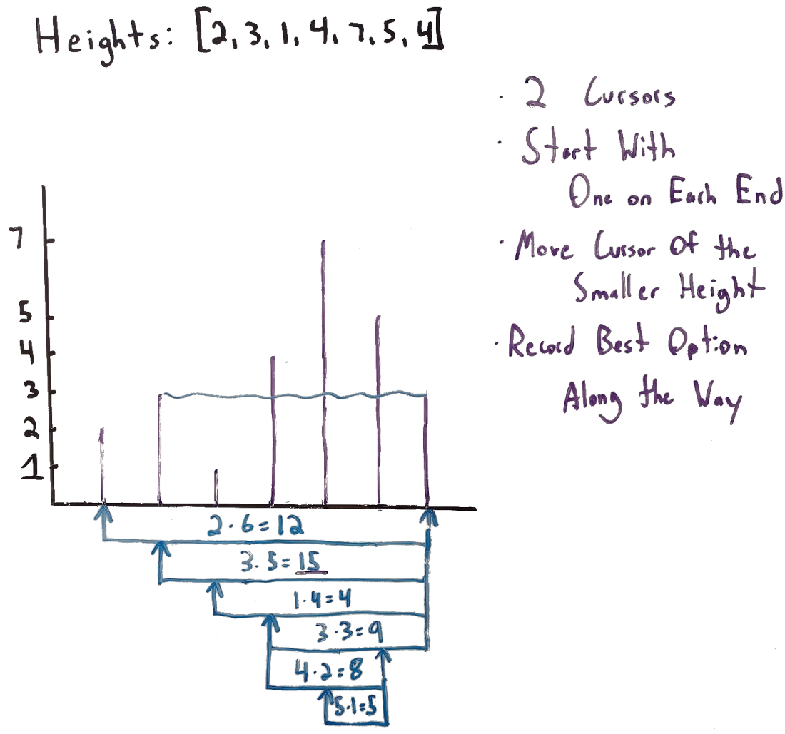

# 11. Container With Most Water
This is my solution for LeetCode's problem 11: https://leetcode.com/problems/container-with-most-water/

## Problem Analysis
We are given a scenario where we have a series of walls on a 2D surface. We want to pour water into this structure in a way that maximizes the amount of water we can hold. The water is poured by selecting two walls as the containers, then pour water until the container is filled as much as possible without spilling over. Note that we treat the walls themselves as having no area, so we don't need to factor that into our calculation. Once the algorithm finishes, it will return the area of the maximum amount of water that can be contained.

## Implementation Strategy
A simple way to implement the solution is to perform a quadratic iteration, which means that for each wall, we check all remaining walls and calculate the available areas. While this would work, it is very inefficient with a time complexity of *O(n^2)*. We can implement a solution which runs in linear time. The whiteboard diagram below explores how to do this. The input heights are: *[2, 3, 1, 4, 7, 5, 4]*; the diagram shows this using a grid where the x-axis has each wall evenly spaced and the y-axis shows the heights of each wall. Under the diagram, we explore an algorithm approach which uses two iterators instead of just one. Instead of performing a nested iteration, we use the left and right iterators to get the area of the water as it would appear if those two walls were selected, then moves the left iterator to the right if the left wall is smaller than the right, or moves the right iterator to the left if the right wall is smaller. This is guaranteed to find the best answer, because at any point: *if the iterator pointing to the smaller of two walls is not moved, any subsequent area found by moving the other iterator will be even worse than the current solution*.
To summarize the algorith:
1. Initialize an int *leftPointer* as 0.
1. Initialize an int *rightPointer* as *height.length - 1*. In other words, it will point to the last wall.
1. While we still have walls to consider (while *rightPointer > leftPointer*):
    1. Calculate *area*: **Min(leftPointerWall, rightPointerWall) * (rightPointer - leftPointer)**.
    1. If it's larger than the best one we've found so far, set this as the best option so far.
    1. If *leftPointerWall > rightPointerWall*, decrement *rightPointer*.
    1. Else: decrement *leftPointer*. 
1. Return the best found solution.

## Space and Time Complexity
The space complexity is *O(1)*, as we only use a small, constant number of variables and space regardless of the input size. The time complexity is *O(n)* as we never revisit a wall once we have moved beyond it.

## Additional Resources
1. [Discussion and Analysis on YouTube](https://youtu.be/T1cpJIMhLEw)