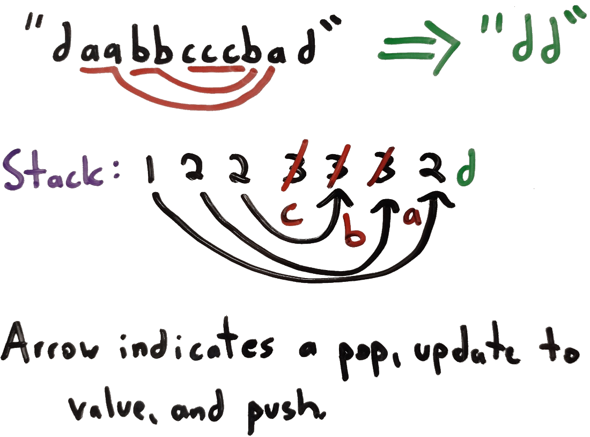

# 1209. Remove All Adjacent Duplicates in String II
This is my solution for LeetCode's problem 1209: https://leetcode.com/problems/remove-all-adjacent-duplicates-in-string-ii/

## Problem Analysis
We are given a string, which we'll refer to as **str**, and an integer **k**. We must remove all occurences of **k** sequences of repeated characters within the string. We must then repeat this process on the new string, etc, until the final string has no **k** sequences of repeated characters. Then, we will return that modified string. The example below, provied by LeetCode, outlines this process:

* **Input**: str="deeedbbcccbdaa" and k="3"
* **Output**: "aa"
* **Explanation**:
    1. First delete "eee" and "ccc", get "ddbbbdaa"
    1. Then delete "bbb", get "dddaa"
    1. Finally delete "ddd", get "aa"

Our implementation will also need to account for these edge cases:

* No **k** sequences of repeated characters exists.
* The removal process will remove every character.
* Sequences will be removed from the very beginning or very end of the input string.

We could accomplish this using quadratic iteration, where for each character, we scan **k** characters to the right to see if we've found a match, and if so, update the string, then backtrack a bit to ensure we don't miss any other updates. However, this has a complexity of *O(n⋅k)*, where **n** is the size of the input string, a complexity which approaches *O(n^2)* as **k** approaches **n**. We should be able to solve this more efficiently.

In order to do so, we'll need to find a way of keeping track of repeated occurences as we iterate through the input string without the need to visit any elements more than once. We'll need to keep track of the number of consecutive occurences of each character we've encountered *so far*. We could try using a map for this purpose, but we'd encounter difficulties if we have more than one consecutive run for the same character. A more appropriate data structure would be a *Stack*. We will have one value on the stack for each distinct occurence of a character within the string. A *distinct occurence* is defined as an occurence of character *x* such that the substring is *[^x]x+[^x]*. In other words, the character to the leftmost occurence is not *x*, we have 1 or more *x* occurences, followed by another non *x* occurences. We can use the stack to keep track of the counts of each instance of *x* within an occurence, and each count itself on the stack represents a distinct occurence.

## Implementation Strategy
The diagram below shows the stack concept applied to an example string "daabbcccbad" for "k=3". We've omitted a few operations for convenience, so instead of inserting "1" at each point, then updating to "2", etc, we insert the appropriate number immediately. The first deletion to make is "ccc"; we see that we have a count of *3*, so we remove the substring. At the next point, we come to the 3rd "b", see the count is *3*, and make the removal again. Then, the remaining "aaa" is also removed, leaving us with "dd" as the output, since we've removed all **k** consecutive occurences and have reached the end of the string.

The algorithm within the Java file is based on the algorithm described in the diagram above. The last question we must answer: what is the most efficient way to make these deletions? A doubly linked list is be suitable for this, as we can keep references to the current node based on the state of the iteration, then navigate as needed when making deletions. Each deletion will take **k** steps. If we used an array of characters, or even Java's *StringBuilder*, this would take *n* steps instea dof *k* steps.

## Space and Time Complexity
In this analysis, *n* corresponds to the length of the input string. The space complexity is *O(n)*. The length of the *linked list* is *O(n)* when we first create it, and the *Stack* can contain up to *n* entries at any given point. The time complexity is *O(n+k)*. The algorithm iterates through each character of the string, giving *O(n)*, and we may need to make deletions, giving *O(k)*.

## Additional Resources
The links below outline some of the points discussed above in more detail.
1. [Introduction to Stacks](https://bytethisstore.com/articles/pg/intro-to-stacks)
1. [Introduction to Linked Lists](https://bytethisstore.com/articles/pg/linked-list)