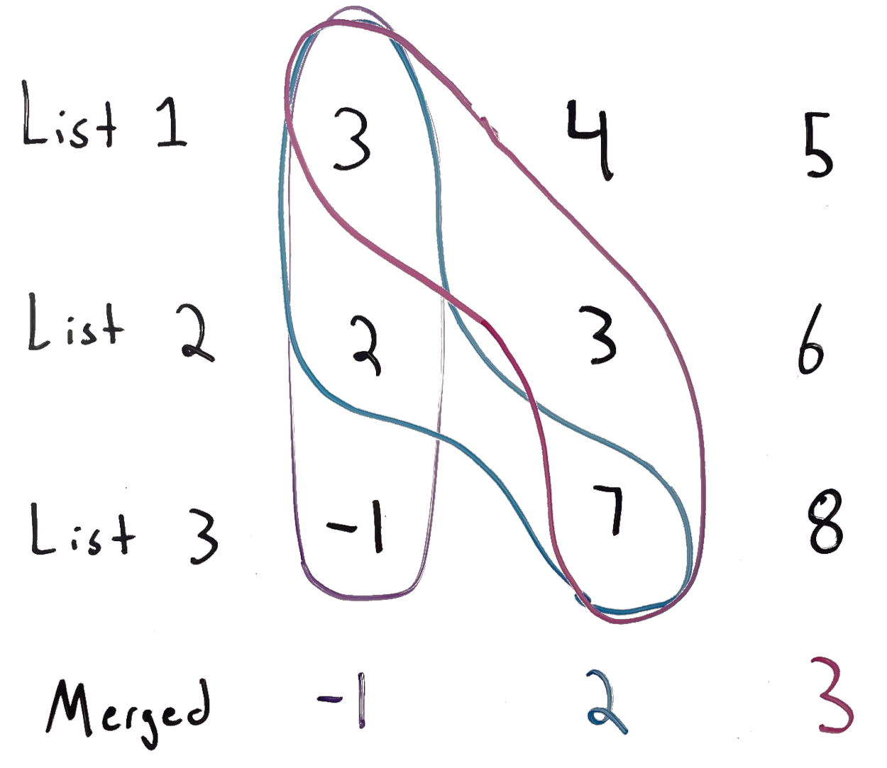

# 23. Merge k Sorted Lists
This is my solution for LeetCode's problem 23: https://leetcode.com/problems/merge-k-sorted-lists/

## Problem Analysis
We're given a list of *ListNode* where each entry represents the beginning node of a linked list which is guaranteed to be sorted. We need to return a new linked list which contains all of the elements from the input lists, still in sorted order. A simple implementation approach would be to perform nested iterations over each list and add values one by one per iteration, but this would be very inefficient. We'll want to make an implementation which iterates over each list only once. We should also be able to handle the edge cases given below:
* Lists may have different sizes
* One or more list may be empty

We can take advantage of the sorted nature of the input linked lists to implement a more performant solution. Since every list is sorted, we know for a fact that the first element of our merged list will be the first element of one of the input lists. Similarly, the last element of the merged list will be the last element of one of the input lists. Similar properties apply for the 2nd, 3rd, 4th, etc. items in the list. The diagram below outlines what an example iteration through the lists would look like, where we take the first item, move through the list, take the 2nd, etc.

## Implementation Strategy
We will follow an implementation approach based on what we see in the diagram above:
1. Start at the beginning of each list and consider all of the 1st elements.
1. Pick the smallest of the 1st elements and put it in our merged list.
1. Move a "pointer" in the list we just selected from to the right.
1. Repeat the process, but with the new pointers.

At a high level, that is a significant improvement over doing a nested iteration as described above. However, we will need to consider how to select the smallest of the current elements at each iteration. If we looped through each list, that would give us a complexity of *O(k)* per iteration, where *k* is the number of input lists. However, if we use a *Heap* structure to hold the "current" elements at each iteration, we will have a smaller complexity of *O(log k)* per iteration, as the insertion and retrieval are both *O(log k)*, both of which happen during each iteration. The heap will internally take care of partially sorting the items, so each time we remove an item, it will be the smallest item in the heap, which is the one we will insert into our merged list.

The full steps of the algorithm can be summarized as:
1. Create a heap *firstItemsHeap*.
1. Initially add the first item of each linked list to *firstItemsHeap*.
1. Poll *firstItemsHeap* and set the head of *mergedList* to the value just polled.
1. Increment the pointer in the corresponding linked list and add that node's value to *firstItemsHeap*.
1. While *firstItemsHeap* has elements:
    1. Poll *firstItemsHeap* and set the head of *mergedList* to the value just polled.
    1. Increment the pointer in the corresponding linked list and add that node's value to *firstItemsHeap*.
1. Return the head of the merged list.

## Space and Time Complexity
In this analysis, we will consider *k* to be the number of input lists and *n* to be the maximum length of the input lists. The space complexity of this implementation is *O(k)*. The heap will contain at most *k* elements, and other than that, we only have a small, constant number of variables which don't depend on the size of *k* or each linked list. The time complexity is *O(n log k)* as we'll be iterating over each item in each list once time, plus the *O(log k)* cost of inserting and removing from the heap. Not if we were not using the heap, the time complexity would be *O(n⋅k)*.

## Additional Resources
1. [Introduction to Linked Lists](https://bytethisstore.com/articles/pg/linked-list)
1. [Introduction to Heaps](https://bytethisstore.com/articles/pg/binary-heap)
1. [Discussion and Analysis on YouTube](https://youtu.be/ErHGoRpJZec)