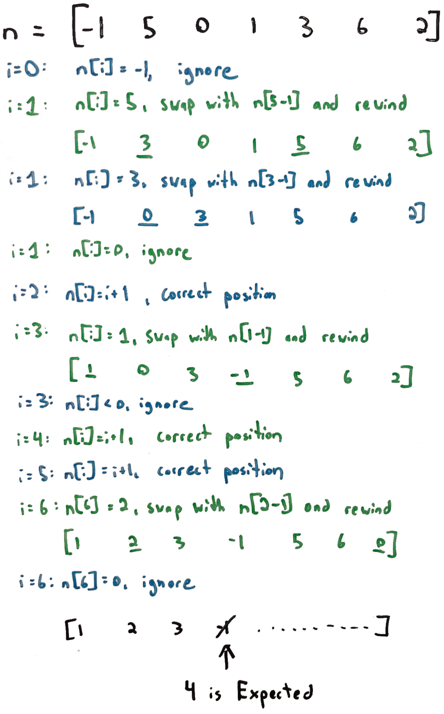

# 41. Find Missing Positive
This is my solution for LeetCode's problem 41: https://leetcode.com/problems/first-missing-positive/

## Problem Analysis
Given a list of integers, we need to return the smallest positive integer which is missing in the input list. The list is not guaranteed to be sorted and each element in the list is not guaranteed to be unique. With that in mind, our implementation must handle the following types of cases:

1. The missing number is smaller than all others included in the input.
1. The missing number is larger than all others.
1. The smallest number missing is larger than the smallest positive integer but smaller than largest positive integer.
1. The list contains one or more instances of duplicate numbers.
1. Is is not in sorted order or is in reverse sorted order.

We are given additional constraints that the time complexity **must** be *O(n)* and the space complexity **must** be *O(1)*, which means that we must be careful not to use any type of quadratic, or otherwise nested, iteration and must be sure we don't use any lists, sets, or maps which grow in size as the input grows. We do *not* have any restrictions on changing the input itself once it comes in; in other words: we can manipulate the input list in any way we need so long as we output the correct answer.

## Implementation Strategy
We will take advantage of the fact that we can manipulate the input array in our implementation. This will provide us with *O(n)* "working space", while still complying with the *O(1)* auxiliary space. We will perform two iterations over the input: the first one to swap certain elements, and the second one to read the elements in swapped order and find the first "unexpected" element. The goal of the first iteration is to *partially* sort the input list, such that for each number 1..n, 1 appears in the 0th index, 2 appears in the 1st index, etc. If the input list has all numbers, all of them will appear in that order. If any are missing, that condition will be violated in one or more place. This partial sorting will take place by swapping items out based on the conditions below, where *n* is the input list and *i* is the current iterator index:

1. If *n[i] < 1 || n[i] >= n.length*, ignore the steps below.
1. If *n[i] == i + 1*, meaning that the item is already in its correct place, ignore the steps below.
1. Store the value from *n[i] - 1* into a temp variable.
1. If *n[tmp] == tmp + 1*, or if the item at the position to swap (based on temp variable) is in its correct place, ignore the steps below.
1. Swap the two items.
1. Rewind the iterator, so we can perform this same action on the item we've just swapped.

The diagram below outlines this full process on an example input list. Once the partial ordering is complete, we will start a new iteration and move through until we find an "unexpected item". At each point, *i* should be equal to *nums[i] - 1*. If it is not, then the missing positive integer is *i + 1*. If we don't encounter this condition at all, then the input array does have all integers from 1...n, so we must return *n+1*.

## Space and Time Complexity
The space complexity is *O(1)*, as we are only using a constant number of variables outside of the initial input itself. The time complexity is *O(n)* as we are only iterating over the input twice.

## Special Note
If we were given a guarantee that each item in the input would be unique, we could solve this using one iteration instead of two. During the iteration, we can keep track of:

1. The smallest positive integer in the list.
1. The largest integer in the list.
1. The sum of all positive integers in the list.

Once the iteration is concluded, we would calculate the *triangle number* of the largest positive integer, meaning the sum from 1 to that integer, and compare to the actual sum. If the two values are the same, then we have all integers from 1...n, so we can return *n.length + 1*. Otherwise, we can return *triangleNumber - actualSum*.

## Additional Resources
1. [Discussion and Analysis on YouTube](https://youtu.be/b35rax6GQkM)