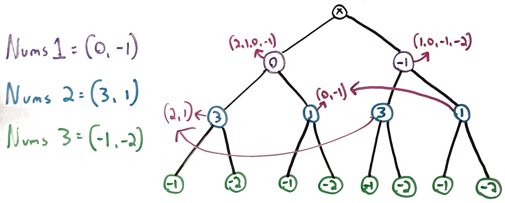

# 454. 4Sum II
This is my solution for LeetCode's problem 454: https://leetcode.com/problems/4sum-ii/

## Problem Analysis
Given four arrays of equal size, we need to check how many ways we can take one element from each array and add them together to get a sum of 0. Each array will be of size *n*, so when we discuss space and time complexity, we can describe all operations in terms of the single term *n*. The naive solution would be to do a loop inside of a loop inside of a loop inside of a loop, but that would require *O(n^4)* iterations, so we will want to find a more performant solution. We can accomplish this by splitting the problem into subproblems and using the proper data structures to work with those subproblems.

The diagram below explores the approach of splitting the problem into subproblems. Here, we'll focus on a simpler version of the problem, one where we have three arrays instead of four. The tree below starts with a blank node marked as "x", then three levels of nodes, each level corresponding to an input array. The first level, in purple, contains each node from the first array. The next level contains the choices from the second array, once per purple choice, and similar for the last level, marked in green. Notice that there are two instances of each blue node and four instances of each green node. This suggests the possibility that we may be able to cache or memoize data in some way to avoid redundant iteration. With this in mind, next to the blue nodes, we've put pairs of numbers in pink. The pair next to "3" indicates that if we add each child node with 3, we get *2, 1* as the summed values. Both instances of the node 3 will have this response. Similarly, both instances of node "1" will have *0, -1* as their summed values. With this in mind, we can evaluate once per node, instead of once per branch, then map the results in case we need them again. Afterwords, we can directly compare the top level nodes with the values in those maps. Any instance of "0" corresponds to a branch which satisfies the constraints of the problem, thus avoid repetition. In the section below, we'll apply this to our implementation strategy.

## Implementation Strategy
We're going to take the observations made above on the simplified problem and apply them to the main problem. With an input of 4 arrays, the tree will have 4 levels instead of three, and if we strictly apply the process above, we'll have two levels of mapping instead of just one, where level 3 will have a mapping similar to level 2 above, and level 2 here will have an additional mapping. However, we can make this more efficient by still using one map instead of two: we'll apply the process above for the sums of the lowest and 2nd lowest levels (corresponding to the last and 2nd to last arrays), then iterate over the first array, and for each item, iterate over the second array. We'll sum the items from the first two arrays and check if the map has a corresponding value. If it does, we've found a branch which results in 0 and can add that to some aggregate value.

## Space and Time Complexity
The space complexity is *O(n)*, as we will have a map which has *n* key value pairs. The time complexity is *O(n^2)*, as we will be performing a nested level iteration on two seperate occasions. Note that the map lookup is in constant time, so it does not add to the time complexity.

## Additional Resources
The links below outline some of the points discussed above in more detail.
1. [Introduction to HashMaps](https://bytethisstore.com/articles/pg/implement-hash-table)