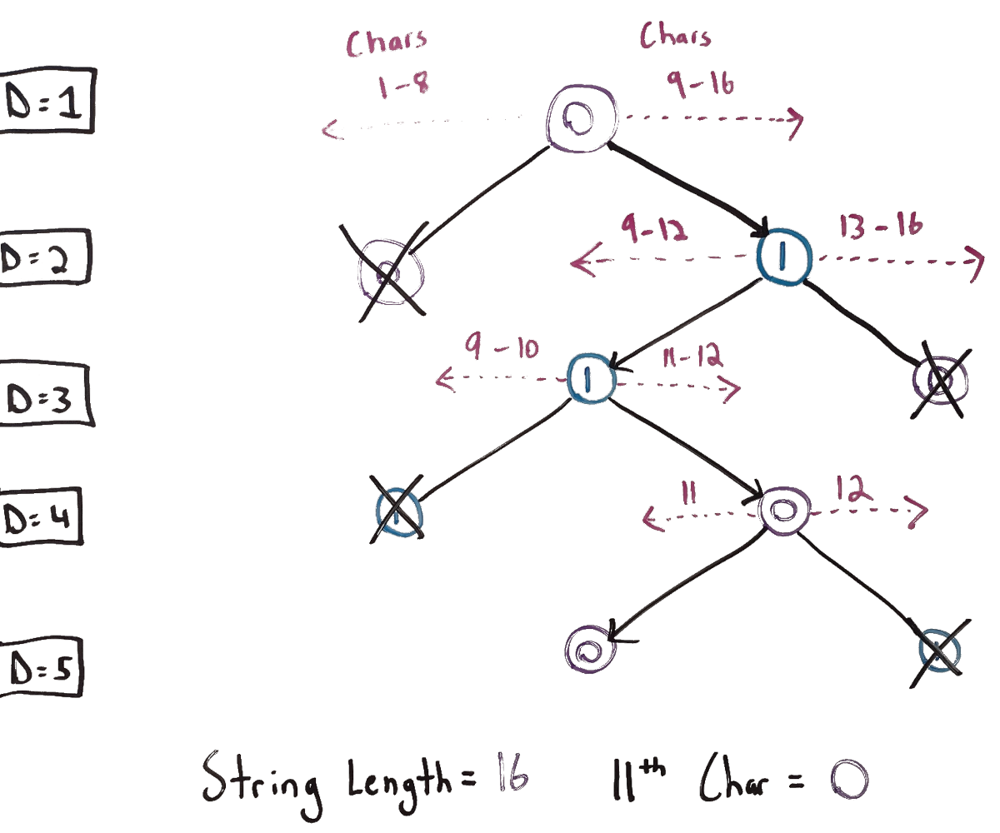

# 779. K-th Symbol in Grammar
This is my solution for LeetCode's problem 779: https://leetcode.com/problems/k-th-symbol-in-grammar/

## Problem Analysis
The problem outlines a set of production rules for generating a string, then asks us for the *kth* symbol of a generated string where we run the production rules *n* times. The description describes it as building a table, but for this outline, we'll consider instead from the perspective of building a string iteratively from an initial string "0". Looking at the rules, we see that for each character in the string will be replaced with two characters. Therefore, we know that our string will become twice as long after each iteration of the production rules. If *n=1*, the size is 1. If *n=2*, the size is 2. If *n=3, n=4*, the sizes are 4 and 8 respectively. In the general case: *strLen=2^(n-1)*. We are in a situation where we make choices regarding *0* and *1* and the overall size of the output string is a power of two. This suggests that we may be able to use a binary tree to deconstruct this problem further.

In the whiteboard diagram below, we have a binary tree (with some subtrees omitted for brevity) which represents the generated string at each depth (corresponding to each value for *n*). In this diagram, we're trying to find the character where *n=5* and *k=11*. Based on the production rules above, we can infer where the *kth* character will be in the tree based on the current depth and branch. At each depth, the diagram marks which char positions come before and after each node. Each node which is crossed out with an "X" indicates a subtree which is ignored because we know for a fact the 11th char will not be in that subtree. Eventually, when we get to the last level of depth, we will arrive at the exact node which corresponds to the *kth* character, and the value at this node will be the value to return in the solution. Note that sometimes "1" is the left child instead of the right child; this is done to account for how the production rules given in the problem description generate the string.

## Implementation Strategy
Thanks to the nature of the production rules as described above, we can use an algorithm which is similar to, but simpler than, binary search to find the value we are looking for. Our algorithm will iterate over different levels of the tree and help make decisions as to whether the overall solution will be a 0 or 1. With this, we do not need to actually generate the string in order to determine the final result. The algorithm can be summarized as follows:
1. Calculate the total size of the output string and store half that result in *strLenHalf*.
1. Create a boolean *isZero* with the initial value of true (corresponding to the initial string "0").
1. We'll be iterating and decrementing *n* throughout. While *n>1*:
    1. If *k > strLenHalf*, meaning that it appears on the subtree to the right:
        1. Flip the value of *isZero*.
        1. Subtract *strLenHalf* from *k*.
    1. Decrement *n*.
    1. Divide *strLenHalf* by two and update its value to the result.
1. When the iteration is done, return 0 if *isZero*, 1 otherwise.

## Space and Time Complexity
The space complexity is *O(1)* as we are only using a small number of variables regardless of input size. The time complexity is *O(n)* as we perform *n* iterations. We can also write is in terms of *O(log len)* where *len* is the length of the string generated by the production rules for *n* iterations.

## Additional Resources
The links below outline some of the points discussed above in more detail.
1. [Introduction to Binary Trees](https://bytethisstore.com/articles/pg/binary-tree)
1. [Binary Search](https://bytethisstore.com/articles/pg/binary-search)