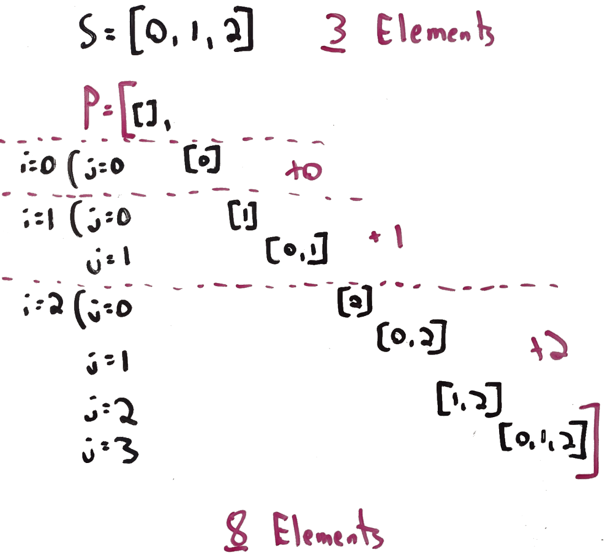

# 78. Subsets
This is my solution for LeetCode's problem 78: https://leetcode.com/problems/subsets/

## Problem Analysis
Given a list of integers *nums*, where each item in the list only appears once, we need to return a list which represents its **power set**, or a list of lists which cointains:

1. An empty list.
1. For every item in *nums*: a list which contains just that element.
1. A list of every combination (not permutation) of 2 items.
1. A list of every combination of 3, 4, 5, up to *n-1* items.
1. The original list itself.

Note that the input is a list of integers, but the output is a list *of lists* of integers. Without delving too much into the math, we know that because we are returning a power set, the number of items in the outer list itself will be *2^n*, including the empty list and the original list itself. We can also calculate how many items each sub list will have, but this is not needed for our implementation, so we will omit this analysis. When assembling the set of sets, we will nee to make sure that:

* We have each the empty list and the original input list with the returned list.
* We have lists of each size from 1 up to *n-1*.
* Each of the combinations are provided in each input size of each list.

## Implementation Strategy
We will implement our algorithm by take a recursive approach of splitting up the problem into sub problems. Given a list of size *s*, we will create the power sets for sublists of size *1*, then size *2*, ...., up to size *s*, and along the way, copy over previously generated sublists so we don't need to start from scratch each time. In the diagram below, we take this idea and apply it to an example input of *[0, 1, 2]*:

1. By default, we include the empty list.
1. We solve the subproblem of having a list with just *0*. We don't repeat the empty list from the previous part, as we already have it.
1. We solve the next subproblem, where we have elements *[0, 1]*. Similarly, we don't repeat list we already have.
1. We solve the remaining subproblem, where we have all input elements.

Each section is seperated with a dotted line, so we can see the new entries provided by solving each additional sub-problem. In our algorithm, we will accomplish this implementation by using a loop with iterator *i* which iterates over the original input items, then a nested loop with iterator *j* which iterates over the sublists we've formed *so far*, copies each sublist into a new one, then appends the current item.

## Space and Time Complexity
The space complexity, including the output answer, is *O(2^n)*. The set returned by the solution itself will be of size *2^n*. The time complexity is *O(n⋅2^(2n))*, as we will be iterating over each element in the input list, then for each, iterating over the partially-generated power set

## Additional Resources
1. [Pascal's Triangle](https://en.wikipedia.org/wiki/Pascal%27s_triangle): if needed, we could use this to determine the size of each sub list.