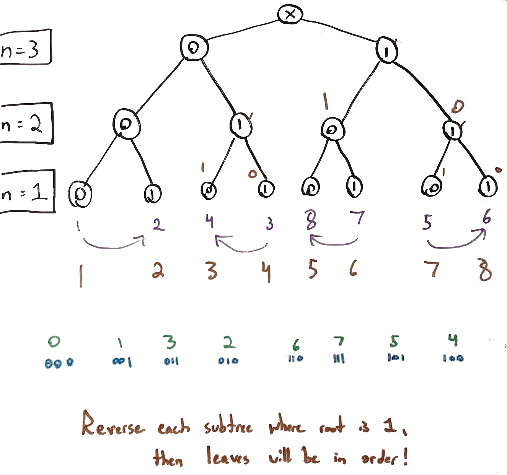

# 89. Gray Code
This is my solution for LeetCode's problem 89: https://leetcode.com/problems/gray-code/

## Problem Analysis
The problem asks us to return a list of integers, in base 10, where the same numbers in binary (base 2) have one and only one of its digits differ between its previous and next entry, and the first and last entries must also only differ by one digit. The problem also outlines additional constraints that the first integer must be 0 and that no integer appears more than once. The fixed starting point of 0 allows us to do some analysis on what the second digit, and last digit, must be. Note that the nature of the list of numbers implies a symmetry: the 2nd and last items will have the same possibilities, the 3rd and 2nd to last items will have the same possibilities, etc. The table below oulines different possible values for the 2nd and last positions for different values of *n*:

| n | binary options                    | decimal options |
|---|-----------------------------------|-----------------|
| 2 | 01, 10                            | 1, 2            |
| 3 | 001, 010, 100                     | 1, 2, 4         |
| 4 | 0001, 0010, 0100, 1000            | 1, 2, 4, 8      |
| 5 | 00001, 00010, 00100, 01000, 10000 | 1, 2, 4, 8, 16  |

We can see a clear pattern emerging: the 2nd number, and last number, both must be powers of 2. Let's do a similar analysis for the 3rd, and 2nd to last positions:

| n | binary options                     | decimal options    |
|---|------------------------------------|--------------------|
| 2 | 11                                 | 3                  |
| 3 | 011, 101, 110                      | 3, 5, 6            |
| 4 | 0011, 0101, 0110, 1001, 1010, 1100 | 3, 5, 6, 9, 10, 12 |

In this second table, it may be possible to derive a statement such as "all numbers are of the form 2^n +- c", but it will be simpler to consider it as *all numbers which have an even number of "1" digits in its binary form*. Similarly, in the first table, all binary numbers have an odd number of "1" digits. This means that the list we will be returning will have values **[bE, bO, bE, bO, ...., bE]**. This implies that the size of the list being returned by the solution must be a multiple of 2 to preserve the alternation. Furthermore, each position *p* (zero indexed) must have exactly *Min(p, len-p)* digit alterations from 0: **[0, 1, 2, .... len/2 ...., 2, 1]**. The length of the list will be *2^n*, as each integer must appear exactly one.

With the information above, we are close to understanding how to generate the sequence. The diagram below outlines:
1. A binary tree representing different binary numbers where *n* is 3, drawn in black marker.
1. An example sequence for *n* = 3, drawn in blue marker at the bottom just above the final text.
1. The example sequence in decimal form, drawn in green marker just above the binary version.
1. The order of sequence items of each leaf node, with arrows indicating if the direction is reversed, drawn in purple marker.
1. The correct order, if the items in purple are swapped, drawn in blue marker.

In other words, we've drawn the original tree, then have analyzed how we can swap certain nodes to allow the leaf nodes to appear in an order which will satisfy the constraints of the problem. We've determined the rules for swapping are:
1. Each right child should have its children swapped.
1. Each left child should have its children in the normal order.

## Implementation Strategy
In this implementation, we will take advantage of some of the properties discussed above. The way subtrees are swapped, we can see that a pattern emerges: for each leaf at position *p* with value *V(p)* starting with position 0:
* **If *p/2* is odd**: *V(p) = p•2*.
* **If *p/2* is even**: *V(p) = p•2+1*

With this in mind, we can take a purely iterative approach to construct the list, and we will not need to initialize the list beforehand, we can add elements as we go. In our approach, we will perform an iteration for a total of *2^(n-1)* times, and each iteration will add two items to the list.

## Space and Time Complexity
If we include the return value in the space complexity, it will be *O(2^n)* which is the size of the return element itself. If we exclude from the analysis, it will be *O(1)*, as only constant auxiliary space is used. The time complexity is *O(2^(n-1))*, as we will be performing an iteration of that many steps.

## Additional Resources
1. [Dealing with Numbers in Different Bases](https://bytethisstore.com/articles/pg/intro-hexadecimal-numbers)