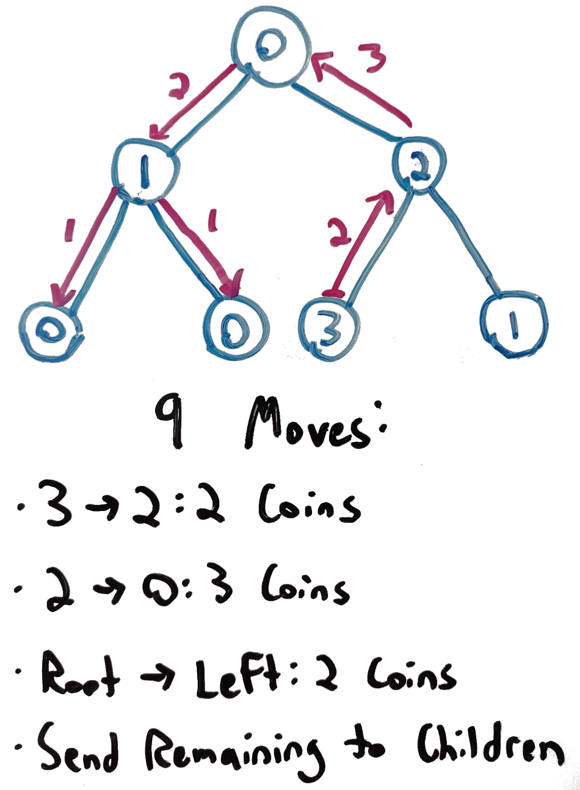

# 979. Distribute Coins in Binary Tree
This is my solution for LeetCode's problem 979: https://leetcode.com/problems/distribute-coins-in-binary-tree/

## Problem Analysis
We are given a binary tree of *n* nodes which hold positive integers or zero, and are told that the sum of the values of the nodes will be *n*. The integer value corresponds to how many "coins" a particular node has. We must find a way to determine how many times we would need to transfer coins from one node to another in order to have every node contain exactly one coin. A *move* is defined as transferring a single coin from one node to its parent or child node. In our implementation, we will want to avoid using redundant space or performing multiple iterations over each node.

The diagram below outlines an example input with an outline of how to make the transfers so that each node has a value of *1*. Note that:

* in some cases, one or more "source" will appear in a lower depth, or even in a leaf node.
* anytime we make a transfer of a coin, we must count the transfer in the overall count, even if the node receiving it will not itself use the coin, and instead pass it along.
* throughout the process, the number of coins overall will always remain the same.
* if no node has a value of *0*, then every node has a value of *1*.

## Implementation Strategy
We will derive the solution by using depth first traversal to assess the state of each node. We will store two seperate values, one to count the transfers needed on the current branch, and one to count overall. The branch transfers can contain negative values, indicating that certain nodes need coins instead of having a surplus of them. The overall algorithm can be summarized as:

1. Keep track of *leftBranchCount* and *rightBranchCount* for the current node.
1. If there is a left child node, recursively follow these steps for that child.
1. If there is a right child node, recurisvely follow these steps for that child.
1. Set the *branchNumTransfers* to *leftCount + rightCount + root.val - 1*. This will sum up the child transfer values with the current node state. If the current node is a 0, this will subtract from the transfers.
1. Add *Math.abs(leftBranchCut) + Math.abs(rightBranchCut)* to the total number of transfers.

## Space and Time Complexity
This has an average space complexity if *O(log n)*, as we will be using the function stack to keep track of our iteration. In the worst case scenario, the space complexity will be *O(n)*. The time complexity is *O(n)*, as we will be visiting each node exactly once.

## Additional Resources
The links below outline some of the points discussed above in more detail.
1. [Graph Traversal Algorithms](https://bytethisstore.com/articles/pg/graph-algorithms-depth-breadth-search)
1. [Discussion and Analysis on YouTube](https://youtu.be/jraf8xjHo9I)